# IIS部署SSL及反向代理

因为nginx在win上性能下降,及其他条件,不得已需要使用windows服务器,所以有了这片文章.

### 1. SSL部署

###### 1. 申请证书

运营商等处申请证书这里不做详述,后期书写let's encrypt部署SSL证书.
 
###### 2. 导入证书

IIS与Apache/Nginx不同,需要手动导入证书后使用,,不是引用文件路径

- win + R (开始-->运行) | 输入 mmc,打开控制台
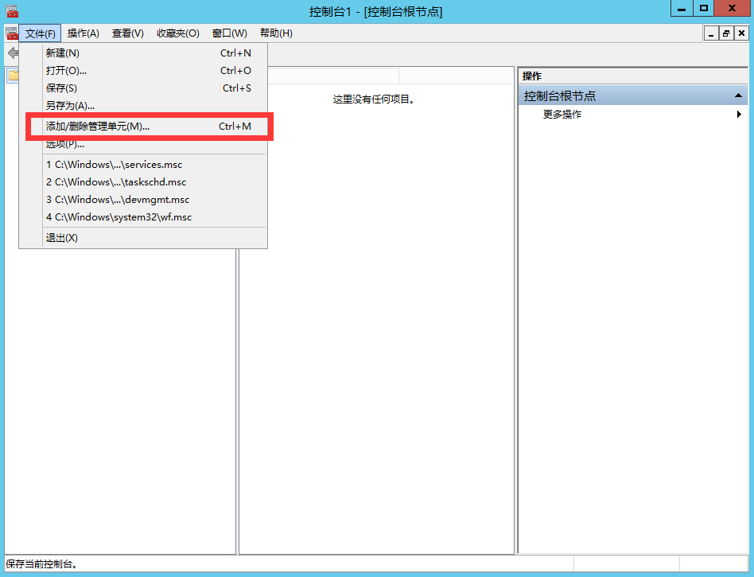
- 文件 --> 添加删除管理单元
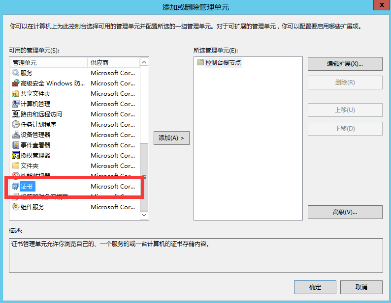
- 选择计算机账户
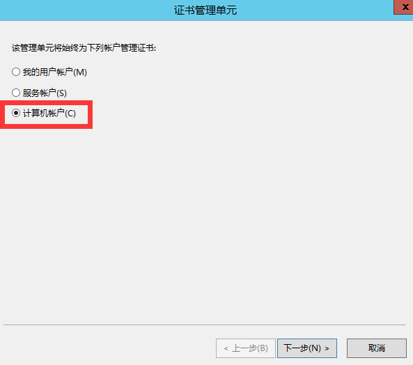
- 完成 --> 确定
- 点击左侧证书,导入
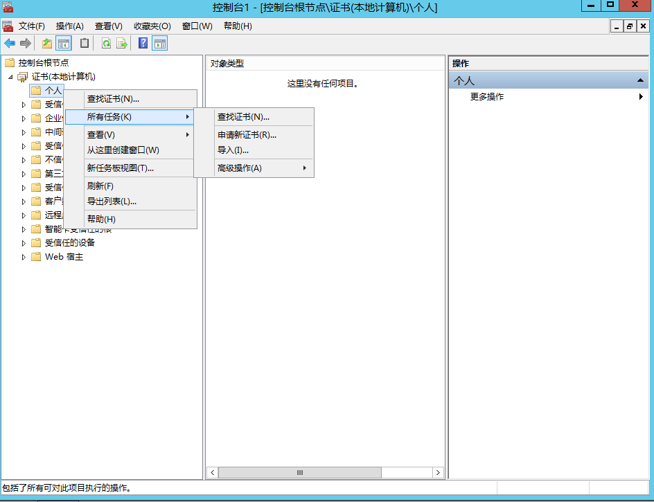
- 导入向导
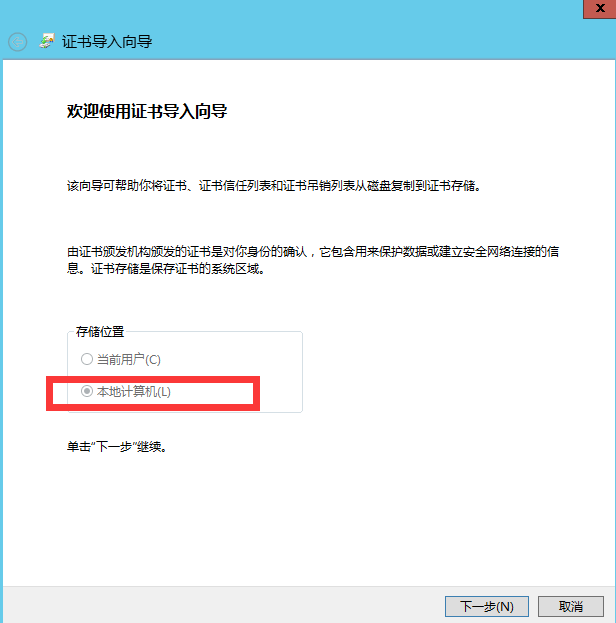
- 选择本地计算机(部分系统默认勾选本地计算机)
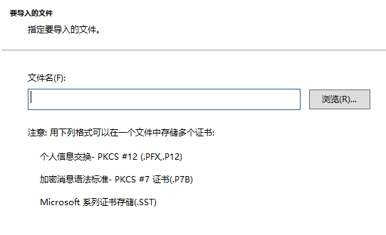
- 找到你申请的证书文件中 ``` .pfx ``` 后缀的文件导入
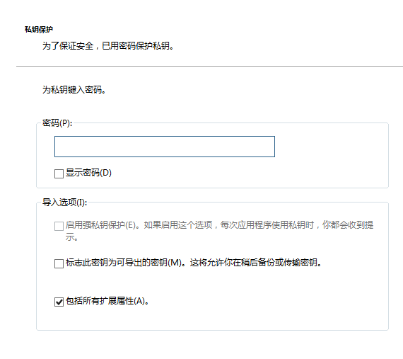
- 这里需要输入创建证书的密码,运营商系统生成的文件会自动提供一个密码文件,一般是.txt文件,将里边的密码输入即可
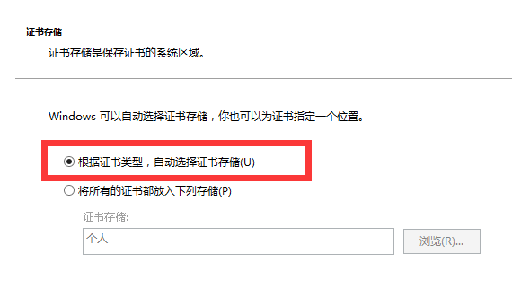
- *** 此步骤重要,勾选根据证书类型自动选择证书存储 ***
- 完成,提示导入成功
- *** 注: 自定义导入证书,默认识别名是alais,不便于使用,可以选择重命名 ***
- 刷新,显示刚导入的证书
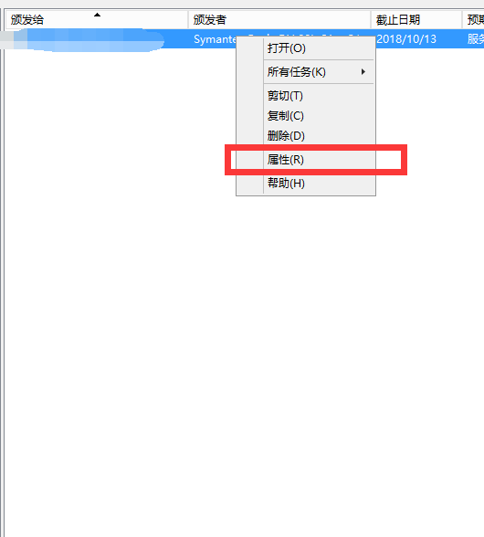
- 修改友好名称(一般为域名,便于识别)


###### 3. 使用证书
- 打开IIS,选择使用证书的站点
- 点击绑定
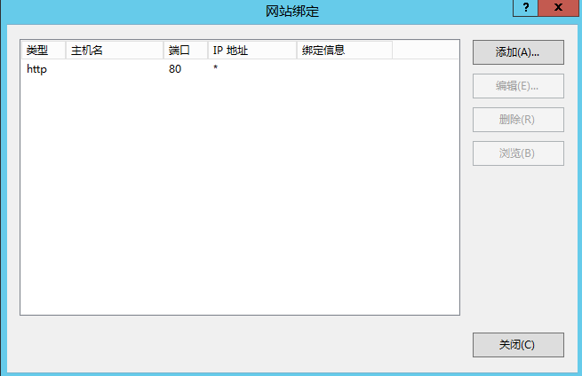
- 选择对应信息
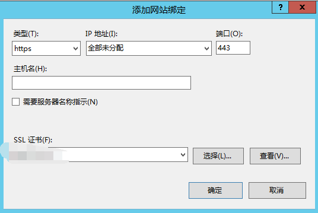
- 确定,重启站点

### 2. Proxy反向代理使用

###### 1. 安装[ARR插件](https://www.iis.net/downloads/microsoft/application-request-routing)

下载组件,安装

###### 2. IIS服务器中出现 ``` Server Farms ```

###### 3. 概念理解

网上的教程大多说的不是很明白,看了一头雾水
IIS的反向代理在其URL重写中,配置入站规则即可

1. 空白规则创建
	- 添加入站规则
	- 名称自定义(proxy_test)
	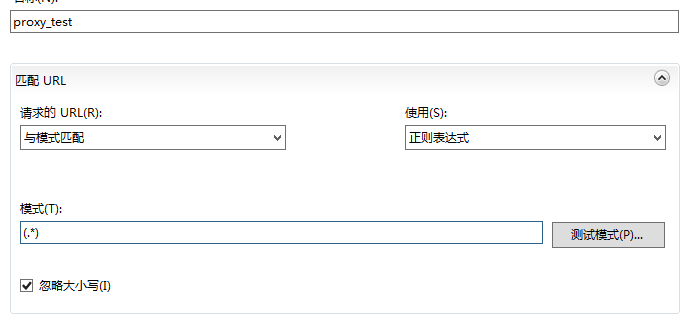
	- 添加匹配模式 *** (属于正则) ***
	(.*)匹配所有有效字符
	- 增加条件
	类似于Nginx中的 ``` if ``` 语句 
	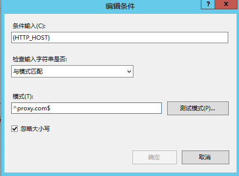
	匹配指定的域名(主机)
	- 操作类型
	*** 重写 ***
	重写URL即为需要反向代理的地址
	比如: https://www.baidu.com
	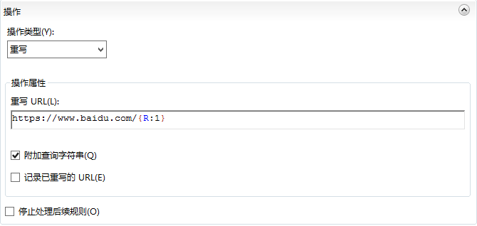

2. 可能觉得上边的操作过于复杂,不好理解,windows一直号称方便使用,因此安装完ARR之后,创建规则的地方有一个反向代理
	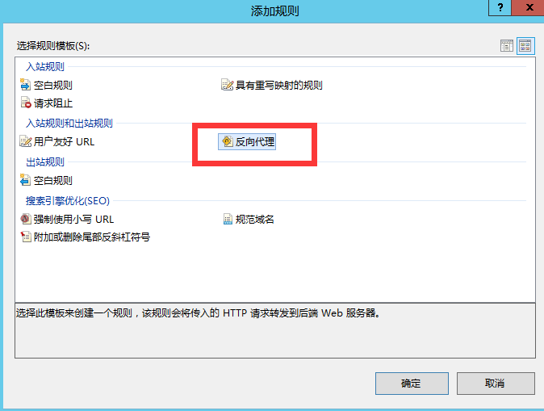
入站规则处填写需要反向代理的IP或者域名	
	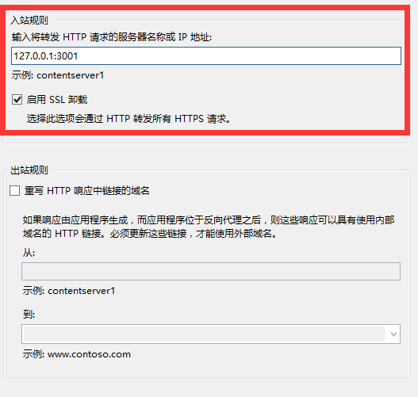
出站规则不要设置
完成