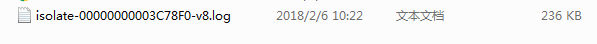
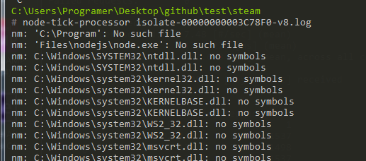
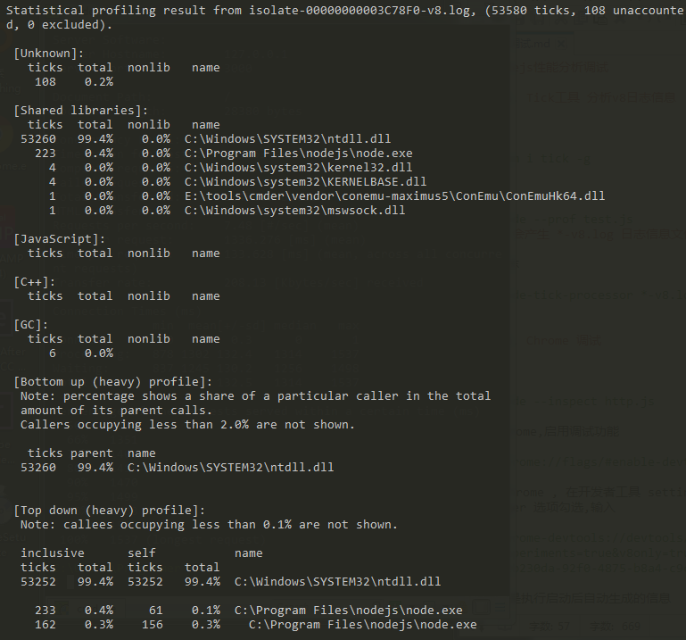
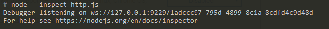
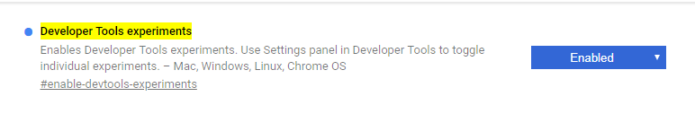
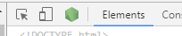
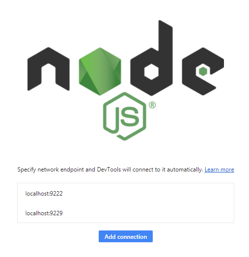
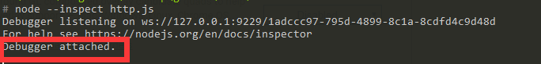
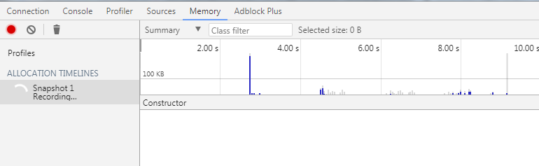

## nodejs性能分析调试

#### 1. Tick工具 分析v8日志信息

安装 
	
	npm i tick -g

启动 

	node --prof test.js
	# 会产生 *-v8.log 日志信息文件较大

分析日志

	node-tick-processor *-v8.log

#### 2. Chrome 调试

启动

	node --inspect http.js

打开chrome,启用调试功能

	chrome://flags/#enable-devtools-experiments

重启 chrome , 在开发者工具 settings -> Experiments 找到Nodejs debugger 选项勾选,输入

	chrome-devtools://devtools/bundled/inspector.html?experiments=true&v8only=true&ws://127.0.0.1:9229/f2b230da-92f0-4875-b8a4-c9c5c5703f29

ws部分是执行启动后自动生成的信息

	ws://127.0.0.1:9229/f2b230da-92f0-4875-b8a4-c9c5c5703f29

Chrome 64 及以上 nodejs debuuger 直接显示在控制台左上角,点击即可自动连接上

显示已经连接调试工具

测试结果

#### 3. Vs Code 中调试

暂无