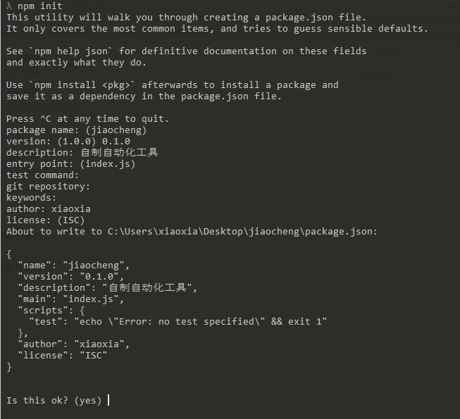
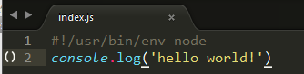
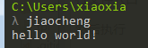

# 使用nodejs创建自己的自动化工具


	nodejs能方便的进行前端的文件压缩结合等等,自动化操作,但是经常使用的我们,是不是也能方便的建立自己的自动化部署工具呢?比如:经常从头建立的文件夹模式,千篇一律的index.html等等


## 开发步骤

#### 1. 安装nodejs环境
从[官网](https://nodejs.org)或[中文官网](https://nodejs.cn)下载nodejs的安装包,参照网上的安装方法安装好nodejs环境,

此处不是介绍nodejs,,因此不介绍如何安装

#### 2. 创建项目
创建项目文件夹,进入并执行npm init,如下图


如下信息是需要填写的 : 

	package name: (jiaocheng)
	version: (1.0.0) 0.1.0
	description: 自制自动化工具
	entry point: (index.js)
	test command:
	git repository:
	keywords:
	author: xiaoxia
	license: (ISC)

在最后生成的package.json中增加一项
	
	"bin":{
		"jiaocheng":"index.js"	
	}

bin为可执行命令,``` " jiaocheng " ```为执行命令,``` " index.js " ```为命令执行文件入口

然后执行
	
	npm link 


此命令向系统增加一条软连接(可以理解为快捷方式)引用,方便使用当前项目的 bin 命令(便于本地调试)

#### 3. 创建index.js,入口文件

一定要在顶部加上 ``` #!/usr/bin/env node ``` 声明,该文件使用环境变量 node 调用

	console.log('hello world!')

如图 : 




然后打开cmd窗口,输入 ```jiaocheng``` 回车,输出如下图



#### 4. 项目依赖选择

此时已经基本成型了,你可以执行命令做一些你想做的事情,也可以自己处理一些 process 变量

常用的nodejs自带 process属性

	process.argv		# 	获取传入参数
	process.cwd()		#	获取当前命令执行所在目录
	process.env			#	获取当前系统用户的环境变量
	process.pid			#	获取当前进程的pid
	process.platform	#	获取当前运行的平台(系统)
	process.stdin		#	输入
	process.stdout		# 	输出
	process.versions	#	当前nodejs环境所有版本信息

常用模块推荐 (持续更新中): 

	commander 	#	作者Tj用于自动生成命令参数获取,单包无依赖

commander 链接及使用看[npmjs](https://npmjs.com/package/commander)介绍或者[github](https://github.com/tj/commander.js)介绍即可

## 模块发布

#### 5. 注册npmjs账号

到[npmjs官网注册](https://www.npmjs.com/signup)一个npmjs账号,用于发布自己的模块

#### 6. 登录npmjs并发布自己的模块

模块按照上面的步骤开发,注册过账号后就可以发布自己的模块了,此处的登录不是在网页上的登录,而是在命令行下执行:

	npm login

会提示输入账号密码,输入注册的账号密码即可

登录成功后,到项目目录下,执行

	npm publish

片刻后便会执行成功

## 注意事项
##### 1. 部分开发者习惯将npm镜像修改为国内的cnpm.js淘宝镜像,在发布包的时候记得将镜像切换回官方 https://registry.npmjs.org/
	
可以执行
	
	npm config list

查看是否替换

##### 2. 发布的npm模块名称必须为全小写,不支持大小驼峰名称,一般修改为英文中横线


